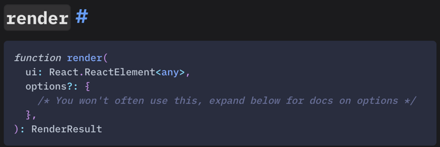
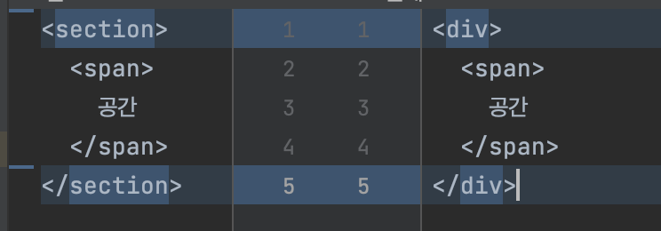

1. 순서가 있는 목차
{:toc}

## 개요
Front End 개발에서도 이제는? 테스트 코드에 대한 중요성이 강조되고 있고 또 많은 테스트 라이브러리와 방법, 패러다임 등이 등장하고 있는 것 같습니다.

수 많은 라이브러리 중 `Jest`{:.primary}와 `Testing library`{:.primary}는
가장 많이 사용된다고 해도 무방할 정도로 많은 기업에서 사용되며, 많은 레퍼런스를 찾아볼 수 있습니다.


저도 자주 사용하는 테스트 라이브러리인데 render 함수를 사용할때 아래와 같이 사용해왔습니다.

```jsx
    const {container} = render(<div></div>);
```

그런데 react query 테스트 코드를 작성하면서 [query test] 를 참고하여 테스트 코드를 작성하면서 render hook과 wrapper 를 조사하면서
render 함수를 제대로 알고 사용하지않는 것을 깨달았고 render()에 대한 내용을 작성합니다.

***

## render()란?
```typescript
    function render(
      ui: React.ReactElement<any>,
      options?: RenderOptions<Q,Container,BaseElement>,
    ): RenderResult
```
- document.body 에 추가되는 container를 jsdom에 렌더링합니다.

기본적인 사용방법은 options를 제외하고 테스트(단위, 통합)를 하고자하는 컴포넌트를 전달하여 
Rendering 하고 테스트를 진행하는 방식으로 사용할 수 있습니다.

공식문서에서도 대부분의 상황에서 options는 필요하지않다고 언급합니다.


그럼 잘 사용하지않는 options에는 어떤 것들이 있기에 잘 사용하지않는지 알아보겠습니다.

***

## Options

```typescript
export interface RenderOptions<
  Q extends Queries = typeof queries,
  Container extends Element | DocumentFragment = HTMLElement,
  BaseElement extends Element | DocumentFragment = Container,
> {
  container?: Container
  baseElement?: BaseElement
  hydrate?: boolean
  legacyRoot?: boolean
  queries?: Q
  wrapper?: React.JSXElementConstructor<{children: React.ReactElement}>
}
```

### container

- `render`{:.primary}는 default로 <div>로 감싼 후 `document.body`에 append 하는 방식으로 컴포넌트를 rendering 합니다.
- 해당 `option`을 활성화하면 `div`가 아닌 다른 `Element`를 `container` 사용할 수 있습니다.

```tsx
    it("render option container 테스트", () => {
      const section = document.createElement("section");
      const article = document.createElement("article");

      const {container, baseElement} = render(<span>공간</span>, {
        container: document.body.appendChild(section),
      });
      console.dir(baseElement);
      expect(container).toMatchSnapshot();
      expect(container).toBeInTheDocument();
    });
```

snapshot 결과



### baseElement
- container 속성은 default container를 재정의 할 수 있는 속성이지만
- baseElement는 container가 append 되는 element를 재정의 합니다.
```tsx
    it("render option baseElement 테스트", () => {
      const section = document.createElement("section");

      const {container, baseElement} = render(<p>컴포넌트</p>, {
        baseElement: document.body.appendChild(section),
      });
      screen.debug();
      console.log(container.tagName);
      console.log(baseElement.tagName);

      expect(container).toBeInTheDocument();
    });
```

:warning: 주의 사항
> container 와 baseElement 모두 `document.body.appendChild()` 를 사용하여 정의를 해주었는데요
> element를 그대로 생성해서 정의하면 `element could not be found in the document` 에러를 만나게 됩니다.<br/>
> 이는 render가 document.body 를 root로 사용하기 때문이기에 `document.body.appendChild()` 를 사용하여 <br/>
> 정의 해주어야합니다.

>> baseElement와 container를 함께 사용할경우 아래처럼 작성해야 body , baseElement, container 순으로 렌더링 됩니다.
>> ```tsx
    const section = document.createElement("section");
    const article = document.createElement("article");
    const {container, baseElement} = render(<p>컴포넌트</p>, {
        baseElement: document.body.appendChild(section),
        container: section.appendChild(article),
    });
>> ```

### hydrate
- type : boolean
- true로 설정하는 경우 ReactDOM.hydrate 와 함께 render 되는 option
- SSR 환경 혹은 ReactDOM.hydrate와 함께 rendering 되어야하는 컴포넌트에 사용할 수 있습니다.

### legacyRoot
- ReactDOMClient.createRoot를 사용하여 rendering 되는 option
- react 18 버전부터는 사용되지않고 17이하의 버전에서 사용해야하는 속성입니다.

### wrapper
- 렌더하는 컴포넌트를 감싸는 wrapper를 정의할 수 있는 option
- 주로 내부적으로 Context를 사용하는 라이브러리들의 provider를 정의해서 사용하기 좋습니다.
```tsx
  const queryClient = new QueryClient({
    defaultOptions: {
      queries: {
        retry: false,
      },
    },
  });

  const wrapper = ({children}: {children: ReactNode}) => (
    <QueryClientProvider client={queryClient}>{children}</QueryClientProvider>
  );

  const renderMain = () => {
    const {container} = render(<Main />, {wrapper});
    const {result} = renderHook(() => useMovieNowContents(), {wrapper});
    return {result, container};
  };
```

:clipboard: Example
```tsx
    import React, {ReactElement} from 'react'
    import {render, RenderOptions} from '@testing-library/react'
    import {ThemeProvider} from 'my-ui-lib'
    import {TranslationProvider} from 'my-i18n-lib'
    import defaultStrings from 'i18n/en-x-default'
    
    const AllTheProviders = ({children}: {children: React.ReactNode}) => {
      return (
        <ThemeProvider theme="light">
          <TranslationProvider messages={defaultStrings}>
            {children}
          </TranslationProvider>
        </ThemeProvider>
      )
    }
    
    const customRender = (
      ui: ReactElement,
      options?: Omit<RenderOptions, 'wrapper'>,
    ) => render(ui, {wrapper: AllTheProviders, ...options})
    
    export * from '@testing-library/react'
    export {customRender as render}
```

### queries
- testing-library의 [queries]를 재정의 할 수 있는 option으로 가장 사용하지않을 option 이라고 생각이 됩니다.
- 만약 query를 커스텀해야하는 경우 혹은 추가해야하는 경우 [custom render guide]를 참고하시기 바랍니다.

***

## Result
`render`{:.primary} 함수를 사용(호출)하는 방법을 알았으니 이제 반환 결과도 알아봐야합니다.

### container
- render 함수로 render 된 `container element`를 반환합니다.
- options의 container를 전달하지 않았다면 `div`를, 정의했다면 정의된 `container`로 감싸진 element를 반환합니다.

### baseElement
- options의 baseElement를 정의하지않았다면 `document.body` 를 반환합니다.
- container와 마찬가지로 option에 baseElement를 정의했다면 정의된 baseElement를 반환합니다.

### queries
- `baseElement`를 기준으로 한 `queries` 를 반환합니다.
- `options`에 정의 된 결과를 반영한 `queries` 를 반환합니다.
```tsx
    const {getByLabelText, queryAllByTestId} = render(<Component />)
```

### debug
- `render()`{:.primary} 의 결과를 `console`에서 확인할 수 있게 출력하는 함수입니다.
- 공식문서에서 `screen.debug()`{:.primary} 를 사용할 것을 권장합니다.
- `console.log(prettyDOM(baseElement)).` 와 동일한 결과를 줍니다.

### rerender
- 렌더링된 결과를 `업데이트` 하기위한 함수를 반환합니다.
- `props`로 전달된 결과를 업데이트 하는 경우 사용할 수 있습니다.
```tsx
    import {render} from '@testing-library/react'
    
    const {rerender} = render(<NumberDisplay number={1} />)
    
    // re-render the same component with different props
    rerender(<NumberDisplay number={2} />)
```

### unmount
- 렌더링된 컴포넌트를 `unmount`{:.primary} 하는 함수
~~~tsx
    import {render} from '@testing-library/react'
    
    const {container, unmount} = render(<Login />)
    unmount()
~~~

### asFragment
- `rendering`된 컴포넌트의 `DocumentFragment`를 반환하는 함수
- 초기 컴포넌트 상태를 가지고있기때문에 컴포넌트의 변화를 `toMatchDiffSnapshot()` 등으로 비교할 수 있습니다.
```tsx
    import React, {useState} from 'react'
    import {render, fireEvent} from '@testing-library/react'
    
    const TestComponent = () => {
      const [count, setCounter] = useState(0)
    
      return (
        <button onClick={() => setCounter(count => count + 1)}>
          Click to increase: {count}
        </button>
      )
    }
    
    const {getByText, asFragment} = render(<TestComponent />)
    const firstRender = asFragment()
    
    fireEvent.click(getByText(/Click to increase/))
    
    
    expect(firstRender).toMatchDiffSnapshot(asFragment())
```

***

## 맺음
test 코드를 작성할때 가장 많이 사용하거나 무조건 사용한다고 할 수 있는 render 함수에 대해서 자세히 알아 보았습니다.

이 전까지는 `options` 없이 사용하거나, return 값 중 container만 사용했었는데<br/>
rerender 와 같은 함수를 활용하여 컴포넌트 재사용을 높일 수도 있고 좋았습니다.


>Reference
>- https://testing-library.com/
>- https://tanstack.com/query/v4/


<!-- Links -->
[query test]: https://tanstack.com/query/v4/docs/react/guides/testing 
[queries]: https://testing-library.com/docs/queries/about
[custom render guide]: https://testing-library.com/docs/react-testing-library/setup#custom-render 